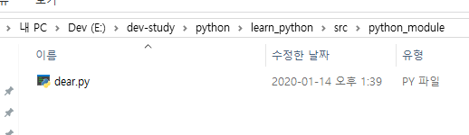
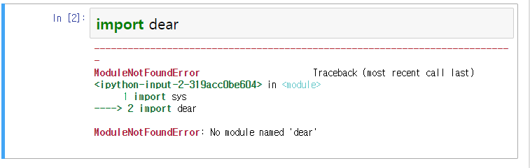
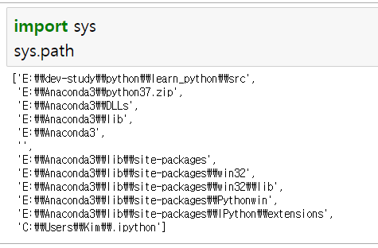
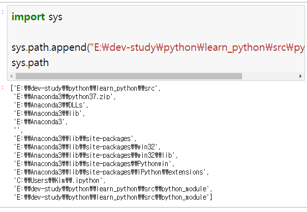
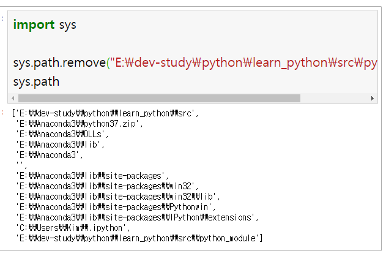
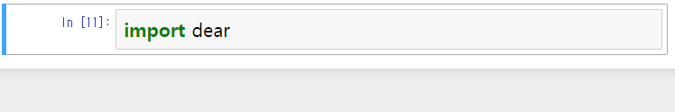
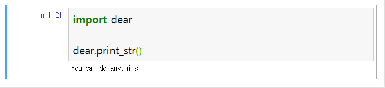
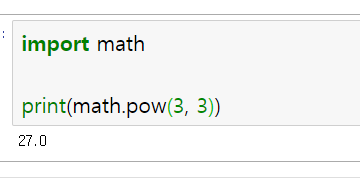

# 모듈(Module)

* 모듈은 함수나 변수, 또는 클래스를 모아 놓은 파일을 말함

* 대개 <span class="custom-markup-text">유사하거나 공통된 일을 하거나, 또는 관련된 일을 하는 함수나 변수</span>를 모아서 하나의 파일에 저장함

* Python 모듈의 확장자는 `.py`

* 모듈의 이름은 확장자를 제외한 파일 이름

  * **EX)** weekyeon.py
    * weekyeon이 모듈 이름

* 모듈 종류

  * `1` 표준 모듈
    * Python 패키지 안에 기본적으로 포함되어 제공되는 모듈
    * 프로그래밍을 할 때 어느 개발자가 됐든 **흔하게** 사용되는 **공통된** 기능들을 **편의를 위해** 파이썬에서 제공하는 것
  * `2` 사용자 정의 모듈
    * 개발자가 직접 정의하여 자신이 자주 사용하는 기능(함수)을 모아 만든 모듈
  * `3` 3rd party 모듈
    * 다른 업체나 개인이 만들어서 제공하는 모듈
    * 대표적인 모듈 : pandas, numpy, matplotlib 등

* 모듈의 사용 목적

  * `1` 코드의 재사용으로 인해 개발 및 유지보수 효율성 증가
  * `2` 프로그램 개발 시 전체 코드를 여러 모듈 단위로 분리하여 설계하면 작업 효율성 증가
  * `3` 별도의 이름 공간(Name space) 제공하여 **동일 이름**의 여러 함수나 변수를 각 모듈마다 독립적으로 정의해 사용 가능

  ---

  * 위의 내용이 정석적인 사용 목적이고 아래 내용부턴 사담에 가까우니, 위 내용이 잘 와닿지 않는다면 읽어도 좋고 너무나 잘 와닿는다면 흐린 눈으로 넘어가는 게 좋음
    * 모듈의 용도는 쉽게 말해서 회사에서 쓰는 공통 양식과 비슷하다.
    * 회사에서 기안문을 쓸 때 사내 양식을 가져와서 내용만 채우지, 기안문 양식부터 만드는 사람은 없다.
    * 왜? 양식부터 만들면 시간이 배로 드니까! 정작 써야 할 기안문은 바로 쓰지 못하니까!
    * 프로그래밍에서는 이와 비슷한 이유로 모듈을 사용한다.
    * 실제 개발을 하다보면 만들어야 하는 기능은 똑같은데 기능 안에 채워야 할 내용만 다른 경우가 생각보다 많다.
    * 이때, 작업의 효율성을 높이기 위해 개발자들은 모듈을 사용한다.
    * 비단 모듈 뿐 아니라 함수를 사용하는 이유도 이와 같다.
    * 프로그래밍을 할 때 항상 염두에 두어야 할 것은, `1` 같은 코드를 반복해서 쓰지 않음 `2` A 라는 기능을 만들기 위해 A 라는 함수를 만들었을 때, 이 A 함수에 언제나 A 기능만 담기는 것은 아님을 잊지 않기
    * 그래서 개발자들은 보통 A 함수에 A 라는 내용만 담을 수 있도록 설계하지 않고 A 함수에 A, B, C도 담을 수 있도록 설계함

<br>

# 모듈 사용하기

* ### 모듈 선언

```python
# 1.
import 모듈명

# ex) weekyeon.py 모듈을 사용하고 싶을 때
import weekyeon
```

```python
# 2.
import 모듈명 as 별칭

# ex) weekyeon.py 모듈을 사용하고 싶은데
# 이름이 너무 길거나 다른 모듈과 충돌이 일어날 것 같아
import weekyeon as wy
```

```python
# 3.
from 모듈명 import [함수명 또는 변수명]

# ex) weekyeon.py 모듈을 사용하고 싶은데 다 쓰고 싶진 않고
# weekyeon.py 안에 있는 특정 기능(함수 또는 변수)만 사용하고 싶어
from weekyeon import func_date
```

```python
# 4.
from 모듈명 import *

# ex) weekyeon.py 모듈에 있는 public 접근제한 기능들만 가져올래
# __(언더바 2개) 붙은 건 안 가져올래
from weekyeon import *
```

```python
# 5.
from 모듈명 import * as 별칭

# ex) weekyeon.py 모듈을 wy라는 이름으로 사용하고 싶은데
# wy라는 이름이 weekyeon.py에서 사용하고 있네?
from weekyeon import * as wy
```

<br>

* ### 모듈에 있는 함수 호출

```python
모듈명.함수(인수)
```

```python
# ex)
import weekyeon as wy

wy.func_date("인수로 던져줘야 할 데이터")
```

<br>

* ### 모듈을 사용할 수 있는 디렉토리 확인

  * 모듈 사용 시 기본적으로 현재 디렉토리(현재 내가 작업하고 있는 폴더의 경로)에 있는 파일이나 파이썬 라이브러리가 저장된 디렉토리에 있는 모듈만 불러올 수 있음
  * 다시 말해서, 현재 디렉토리 또는 파이썬 라이브러리가 저장된 디렉토리 외의 위치(경로)에 있는 모듈을 사용하고 싶을 때 **sys 모듈**을 이용하여 컨트롤 가능
    * 모듈 파일 위치를 옮기면 되는 거 아냐? 라고 생각할 수 있는데 그 누구도 회사의 공통 양식이 있는 폴더 위치를 바꾸지 않는 것과 유사한 이치.
  * 예를 들어, 현재 내 디렉토리 위치는 `E:\weekyeon` 이고 내가 사용하고 싶은 모듈이 있는 디렉토리의 위치는 `D:\temp\python\src` 라고 가정해보자.

```python
import sys

# 아래 명령어를 사용하게 되면, 현재 내가 사용하고 있는 디렉토리들의 경로가 뜸
sys.path

# 출력 결과
'''
['E:\\dev-study\\python\\learn_python\\src',
 'E:\\Anaconda3\\python37.zip',
 'E:\\Anaconda3\\DLLs',
 'E:\\Anaconda3\\lib',
 # 아마도 ▲ 얘가 파이썬에서 제공하는 파이썬 라이브러리(모듈)가 담긴 디렉토리 위치일 듯
 'E:\\Anaconda3',
 '',
 'E:\\Anaconda3\\lib\\site-packages',
 'E:\\Anaconda3\\lib\\site-packages\\win32',
 'E:\\Anaconda3\\lib\\site-packages\\win32\\lib',
 'E:\\Anaconda3\\lib\\site-packages\\Pythonwin',
 'E:\\Anaconda3\\lib\\site-packages\\IPython\\extensions',
 # ▲ 얘네들은 주피터 노트북을 사용하기 위해 실행되어야 할, 또는 필요한 파일들이 있는 위치
 'E:\\weekyeon\\.ipython']
 # ▲ 아마도 내 위치?ㅋㅋㅋ
'''

# 결과를 보면 알겠지만
# D:\temp\python\src 이 경로는 어디에도 없음
# 즉, 지금의 나는 D:\temp\python\src 이 경로에 있는 모듈을 사용하지 못함
# 사용하려면 아래 명령어를 써서 추가해주면 됨
sys.path.append("D:\temp\python\src")

# 등록한 경로를 삭제하려면 아래 명령어 사용
sys.path.remove("D:\temp\python\src")
```

<br>

# 모듈 만들고 사용하기 A to Z

* ### Step 1. 모듈 만들기

  

  * 나는 지금 `E:\dev-study\python\learn_python\src\python_module` 이 경로에 `dear.py` 라는 모듈을 만들었음
  * 모듈 만드는 순서
    * `1` 메모장을 켠다.
    * `2` 모듈에 있었으면 하는 함수를 작성한다.
    * `3` 모든 파일로 저장하기를 선택하고, 모듈명을 적고 `.py`를 붙여준다.
    * `4` 저장하기 전에 인코딩 설정을 `UTF-8`로 바꿔준다.

* ### Step 2. 모듈 선언하기

  * 이제 내가 만든 모듈을 실제 개발 환경(주피터 노트북)에서 선언하고 사용해보자.

  

  * 모듈을 찾을 수가 없다고 한다. 때려치자!
  * 때려치기 전에 현재 내 개발 환경이 참조하고 있는 디렉토리 리스트를 뽑아봤다.

  

  * `E:\dev-study\python\learn_python\src\python_module` 경로가 없네? 등록해보자.

  

  * 경로가 쓸데없이 2번이나 등록됐다. 하나는 지울게~!

  

  * 이제 다시 내가 만든 모듈을 선언해보자.

  

  * 오류가 안뜨는 걸 보니 뭐 잘 선언된 거겠지. 확인해보자~!

  

  <br>

# 파이썬에서 제공하는 모듈 사용하기

* 모듈을 선언하고 사용하는 방법은 사실 위에 적은 과정과 다르지 않다.
* 하지만 해야겠지.
* 우린 주말동안 신나게 놀았으니까.
* 근데 cmd 창 켜고 모듈 어쩌고 저쩌고 하는 건 안할 거다.
* 그렇게 사용하는 개발자 단 1명도 없다에 내 손톱 걸 수 있다.

<br>

* ### 파이썬에서 제공하는 모듈 사용하기

  

  * 이게 무슨 뜻인지 알아보자!
    * 파이썬에서 제공하는 모듈 중 math 라는 모듈이 있다.
    * 이 math 모듈 안에는 수학과 관련된 함수들이 잔뜩 있다.
    * 그 중 하나가 사진에서 보이는 pow( ) 함수인 것.
    * pow 함수는 2개의 인수(3, 3)를 받아서 제곱을 할 수 있는 코드가 작성되어 있을 것. 
    * 여태 수업 내용을 복기해보면 계산기 만들겠다고 함수 생성해서 add, sub, multi 등등 작업을 했다.
    * 파이썬에서 제공하는 모듈 하나만 썼을 뿐인데 코드가 두 줄로 줄었다!
    * 그럼 파이썬에서 제공하는 모듈이 뭐가 있고, 그 모듈 안에는 어떤 함수가 정의되어 있고, 나는 그거를 다 알아야 하는 거야? 라는 생각이 들 수 있는데
      * 맞아요~!
      * 강사님이 마지막 날 홈페이지 3개 보여주면서 이거 보세요 했던 그 사이트들
      * 거기에 저런 게 정의되어 있다
      * 내 기억엔 pandas, numpy 얘네 문서였던 것 같은데.. 사용설명서라고 생각하면 됨.
      * 파이썬 홈페이지에 document를 찾아보면 저 math 모듈에 뭐가 있는지 다 적혀있다.
      * 개발자들도 정말 많이 써서 외울 정도가 된 게 아닌 이상 다 구글링해서 document 참고하면서 사용함.